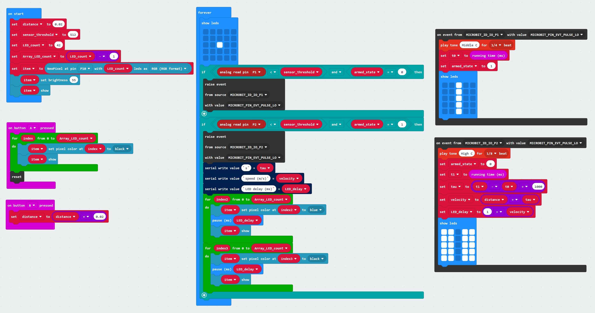

# Assessment 1: Replication project

## Replication project choice ##

### :racing_car: **Timing Gates** 

The original project uses a simple mechanism of detecting a closed circuit to trigger a pin activation (timestamp) event whereby two strips of foil are placed within a few millimeters of each other to enable a toy car with a piece of foil taped to its undercarriage to close the circuit as it passes over the foil gates. The difference between the timestamp events is then displayed using the on-board microbit LED display.

My project expands on this idea in the following ways.
 * Using TCRT5000 Optical Sensors to trigger gate events
 * Using a piezzo buzzer to trigger sounds when the gate events occur
 * Using the microbit LED display to provide visual feedback when each gate event occurs.
 * Providing a programmed state mechanism to ensure gate events occur in correct sequence.
 * Providing a means to reset the system to interrupt a slow simulation  
 * Providing a means to increment the distance between the sensors should the non-default distance be required.
 * Using a strip of Neopixels as a feedback mechanism to display a simulation of the calculated speed.

Additionally, the aesthetic of the final project will employ a Hot Wheels race track which will be retrofitted with the electronics as discretely as possible. This will include inserting the Neopixel strip into one or more lengths of the track while - in the case of multiple track lengths, it would be desirable to use a modular connection mechanism to link multiple Neopixel lengths. This would ensure the toy could be constructed/deconstructed in the usual manner without imposing limitations on its conventional designed use.
 

## Related projects ##

### Related project 1 ###
**Junkyard Engineering - Bluetooth Laser Gate Timer**

https://www.youtube.com/watch?v=SxFBqXPfO84

This project is related to mine because it uses two sensors (in this case lasers) to trigger the recording of timestamps for calculating speed of an object traveling between the timed gates.

### Related project 2 ###
**Neopixel Light Painting Stick**

                 |                  |  
---------------------- | ---------------------- | ----------------------
 |  | 

This is one of my previous projects and is related to this one due to commonalities of using a strip of Neopixels and timing mechanisms; in this case to display an image - one column of pixels at a time. This enables the creation of interesting long-exposure camera effects that produce the illusion of light painting in 3D space.

### Related project 3 ###
**DIY Hot Wheels Drag Race Timer**

https://hackaday.com/2015/01/19/diy-hot-wheels-drag-race-timer/

This shares the idea I have of modifying a toy Hot Wheels race track for this project. This similarly uses timed gates - in this case low power laser modules mounted under the track, and displays the calculated times on LCD displays above the track.

### Related project 4 ###

### Related project 5 ###

### Related project 6 ###

## Reading reflections ##
*Reflective reading is an important part of actually making your reading worthwhile. Don't just read the words to understand what they say: read to see how the ideas in the text fit with and potentially change your existing knowledge and maybe even conceptual frameworks. We assume you can basically figure out what the readings mean, but the more important process is to understand how that changes what you think, particularly in the context of your project.*

*For each of the assigned readings, answer the questions below.*

### Reading: Don Norman, The Design of Everyday Things, Chapter 1 (The Psychopathology of Everyday Things) ###

*What I thought before: Describe something that you thought or believed before you read the source that was challenged by the reading.*

I question the statement that an ‘affordance is not a property‘ [of the object] – with reference to the provided example of the weight of a chair and its ability to be lifted/moved is dependent on the capability of the agent. My argument is that an object (the chair) is attributed a weight which is a property of the object – and the specified weight, length, height etc (attribute/property) of the object is typically labelled as such therefore signifying to the agent the limitations imposed by the attributes. 

*What I learned: Describe what you now know or believe as a result of the reading. Don't just describe the reading: write about what changed in YOUR knowledge.*

What Norman hinted at with his discussions with Gibson but failed to articulate, is the fact that much of what is known about how to interact with objects whether natural or artificial is that of **learned experience**. I dissagree with Gibson's idea that interaction is acheived without internalised cognitive processing. Humans use combinations of their senses to cognitively process their worldly interactions, but that only describes the superficial interface between object and interaction. It is the application of prior learned experiences that facilitates the 'know how' when learning to interact within novel situations. Given Gibson's argument, we'd all be born with the innate ability to fully interact with our environment without the need for memory and learning from our experiences.

*What I would like to know more about: Describe or write a question about something that you would be interested in knowing more about.*

I'm quite familiar with the terms discussed in this text - they are commonly used in IT systems engineering.

*How this relates to the project I am working on: Describe the connection between the ideas in the reading and one of your current projects or how ideas in the reading could be used to improve your project.*

The enhancements I will be making to the existing product will afford its user a new level of engagement; through the application of novel feedback mechanisms by way of light and sound effects, and simple interface signifiers that a child would have no problem interpreting or understanding.

### Reading: Chapter 1 of Dan Saffer, Microinteractions: Designing with Details, Chapter 1 ###

*What I thought before: Describe something that you thought or believed before you read the source that was challenged by the reading.*

*What I learned: Describe what you now know or believe as a result of the reading. Don't just describe the reading: write about what changed in YOUR knowledge.*

*What I would like to know more about: Describe or write a question about something that you would be interested in knowing more about.*

*How this relates to the project I am working on: Describe the connection between the ideas in the reading and one of your current projects or how ideas in the reading could be used to improve your project.*

### Reading: Scott Sullivan, Prototyping Interactive Objects ###

*What I thought before: Describe something that you thought or believed before you read the source that was challenged by the reading.*

*What I learned: Describe what you now know or believe as a result of the reading. Don't just describe the reading: write about what changed in YOUR knowledge.*

*What I would like to know more about: Describe or write a question about something that you would be interested in knowing more about.*

*How this relates to the project I am working on: Describe the connection between the ideas in the reading and one of your current projects or how ideas in the reading could be used to improve your project.*

## Interaction flowchart ##
*Draw a flowchart of the interaction process in your project. Make sure you think about all the stages of interaction step-by-step. Also make sure that you consider actions a user might take that aren't what you intend in an ideal use case. Insert an image of it below. It might just be a photo of a hand-drawn sketch, not a carefully drawn digital diagram. It just needs to be legible.*

## Process documentation

First draft MakeCode screenshot

Initial testing of single Neopixel strip triggered by a pair of TRC5000 sensors

                |                   
---------------------- | ---------------------- 
 | 

Purchased a Hot Wheels track set ($17) which has dual car tracks, two cars and dual manual mechanisms for shooting the cars down the track which is ideal since this will allow greater variability with testing as opposed to track sets that have an electronic launch system which would be pretty much consistent with each event... so I'm now extending the original intent to include handling dual track electronics.

                |                   
---------------------- | ---------------------- 
  | 

https://player.vimeo.com/video/398522609

 
Note to self... testing the Neopixel strips seem to work best (with lab power) at 3.3v and not 5v. Also, the Micro:Bit is very finnicky regarding which pins can support them which took some time to figure out... Using Pin8 produced perfect results while Pin9 produced incorrect colour and that pesky #1 green pixel problem! Switching the second strip to use Pin11 resolved this.

**Added an IC2 LCD1602 display module**

**Testing the dual Neopixel strips along with the LCD**
https://vimeo.com/398761390

I'm not satisfied with the TRCT5000 sensors - mainly with regards to responsiveness. Initial car testing shows that the sensors are not triggered as the cars are travelling too quickly for it to register so I'm changing the sensor type to **photo-resistors**. I only decided to use the TRCT5000's because I bought a pile of them several years ago for another project. I have only 3 photo-resistors so will have to see if I can get a fourth from Jaycar. Hopefully with a little tweaking these will prove to be somewhat more responsive than the former.

I bought the fourth sensor from Jaycar but it looks slightly different to the version I have. I've wasted about 12 hours on this sensor issue. Tried all manner of tweaks including retesting sensed values using different resistors etc. The fourth sensor just doesn't behave like the others and I've given up with doing two tracks; although it should be noted that the design of the system can easily accommodate a second track.

I have had to rework the MakeCode algorithm to remove some of the serial processes that were making the system very sluggish and causing a reduced 'sensitivity' of the sensor arrangement. Breaking out chunks of code into their own 'Forever' constructs effectively provides multi-tasking facility and has now been tested to be very responsive.

**The revised MakeCode algorithm**

**Electronics installation begins**
                |                   
---------------------- | ---------------------- 
  | 
  | 
 
  

## Project outcome ##

### Project title ###
**Hot Wheels V2 Racetrack**

### Project description ###

The project enhances an existing Hot Wheels toy car dual race track to incorporate a number of electronic modifications based on the Micro:Bit controller. The manufacturer indicates that the toy is suitable for children ages 4-10, however with the addition of potentially hazardous electronic components this would be adjusted to a higher age bracket accordingly.
The enhancements include the addition of sensors that are used to calculate the speed of each car as it is ejected from the launch mechanism. As each car passes the sensors, a beep is emitted indicating the timer has been triggered. The speed is also simulated visually with a strip of 33 RGB LEDs (Neopixels) embedded in a segment of each track, as well as being displayed on an LCD screen above the track.
The intent here is to elevate the enjoyment and experience of play through the addition of interaction by means of visual and audio feedback elements.

### Showcase image ###

*Try to capture the image as if it were in a portfolio, sales material, or project proposal. The project isn't likely to be something that finished, but practice making images that capture the project in that style.*

### Additional view ###

*Provide some other image that gives a viewer a different perspective on the project such as more about how it functions, the project in use, or something else.*

### Reflection ###

*Describe the parts of your project you felt were most successful and the parts that could have done with improvement, whether in terms of outcome, process, or understanding.*

*What techniques, approaches, skills, or information did you find useful from other sources (such as the related projects you identified earlier)?*

*What ideas have you read, heard, or seen that informed your thinking on this project? (Provide references.)*

*What might be an interesting extension of this project? In what other contexts might this project be used?*
