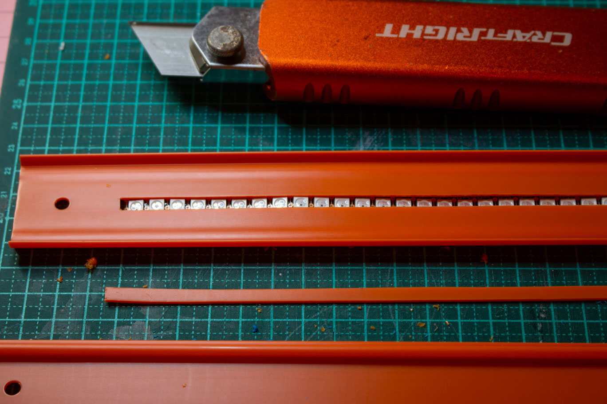
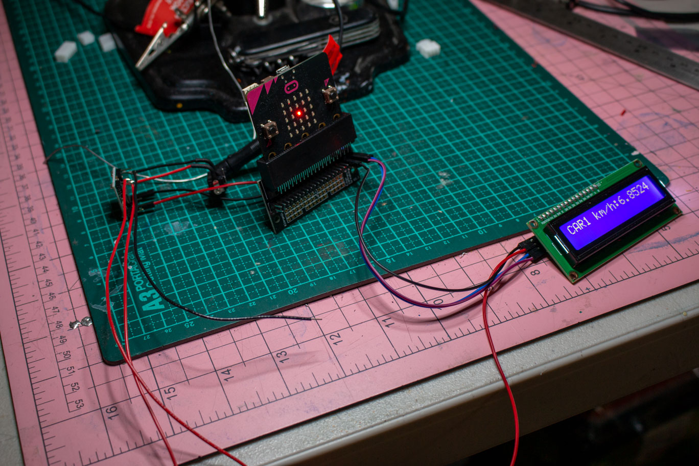

# Assessment 1: Replication project

## Replication project choice ##

### :racing_car: **Timing Gates** 

The original project uses a simple mechanism of detecting a closed circuit to trigger a pin activation (timestamp) event whereby two strips of foil are placed within a few millimeters of each other to enable a toy car with a piece of foil taped to its undercarriage to close the circuit as it passes over the foil gates. The difference between the timestamp events is then displayed using the on-board microbit LED display.

My project expands on this idea in the following ways.
 * Using Photo-resistor sensors to trigger gate events
 * Using a piezzo buzzer to trigger sounds when the gate events occur
 * Providing a programmed state mechanism to ensure gate events occur in correct sequence.
 * Providing a means to reset the system via on-board button press
 * Using a strip of Neopixels as a feedback mechanism to display a simulation of the calculated speed.
 * Using an external LCD screen to display calculated speed.

Additionally, the aesthetic of the final project will employ a Hot Wheels race track which will be retrofitted with the electronics as discretely as possible. This will include placement of timing sensors and inserting the Neopixel strip into length of the track as well as housing the driving electronics in an integrated unit.
 
## Related projects ##

### Related project 1 ###
**Junkyard Engineering - Bluetooth Laser Gate Timer**

https://www.youtube.com/watch?v=SxFBqXPfO84

This project is related to mine because it uses two sensors (in this case lasers) to trigger the recording of timestamps for calculating speed of an object traveling between the timed gates.

### Related project 2 ###
**Neopixel Light Painting Stick**

                 |                  |  
---------------------- | ---------------------- | ----------------------
 |  | 

This is one of my previous projects and is related to this one due to commonalities of using a strip of Neopixels and timing mechanisms; in this case to display an image - one column of pixels at a time. This enables the creation of interesting long-exposure camera effects that produce the illusion of light painting in 3D space.

### Related project 3 ###
**DIY Hot Wheels Drag Race Timer**

https://hackaday.com/2015/01/19/diy-hot-wheels-drag-race-timer/

This shares the idea I have of modifying a toy Hot Wheels race track for this project. This similarly uses timed gates - in this case low power laser modules mounted under the track, and displays the calculated times on LCD displays above the track.

## Reading reflections ##

### Reading: Don Norman, The Design of Everyday Things, Chapter 1 (The Psychopathology of Everyday Things) ###

*What I thought before: Describe something that you thought or believed before you read the source that was challenged by the reading.*

I question the statement that an ‘affordance is not a property‘ (of the object) – with reference to the provided example of the weight of a chair and its ability to be lifted/moved is dependent on the capability of the agent. Norman suggests that the chair affords itself to be lifted (or not) as a personification of the object. My argument is that an object (the chair) is attributed a weight which is a property of the object – and the specified weight, length, height etc (attribute/property) of the object is typically labelled as such therefore signifying to the agent the limitations imposed by the attributes. Affordance is an odd term in this context and used as if the object has free will.

*What I learned: Describe what you now know or believe as a result of the reading. Don't just describe the reading: write about what changed in YOUR knowledge.*

What Norman hinted at with his discussions with Gibson but failed to articulate, is the fact that much of what is known about how to interact with objects whether natural or artificial is that of learned experience and memory. I dissagree with Gibson's idea that interaction is acheived without internalised cognitive processing. Humans use combinations of their senses to cognitively process their worldly interactions, but that only describes the superficial interface between object and interaction. It is the application of prior learned experiences that facilitates the 'know how' when learning to interact within novel situations. Given Gibson's argument, we'd all be born with the innate ability to fully interact with our environment without the need for memory and learning from our experiences.

*What I would like to know more about: Describe or write a question about something that you would be interested in knowing more about.*

I'm quite familiar with the terms discussed in this text - they are commonly used in IT and systems engineering.

*How this relates to the project I am working on: Describe the connection between the ideas in the reading and one of your current projects or how ideas in the reading could be used to improve your project.*

The enhancements I will be making to the existing product will afford its user a new level of engagement; through the application of novel feedback mechanisms by way of light and sound effects, and simple interface signifiers the target market would have no problem interpreting or understanding.

### Reading: Chapter 1 of Dan Saffer, Microinteractions: Designing with Details, Chapter 1 ###

*What I thought before: Describe something that you thought or believed before you read the source that was challenged by the reading.*

While I'm not an iPhone user, I would have presumed that when a user chooses to mute the phone that would include every noise produced by the device. It was surprising to read that this was not the case.

*What I learned: Describe what you now know or believe as a result of the reading. Don't just describe the reading: write about what changed in YOUR knowledge.*

It is interesting reading about the things that I know from an IT perspective through the lense of product design. Micro-interactions are what I know as features or services. Before the days of smart-phones and 'apps', software application development considered these things as 'bells & whistles' and production teams were rarely afforded the luxury of entertaining the implementation of these as they were both labour intensive and contentious (where significant resources could be wasted battling clients expectations and aesthetic variances). 

Additionally, these extraneous items would slow down processing of the system in a time where performance was the most important directive. Obviously as technology and job roles have evolved and system performance is no longer given precedence, micro-interactions are presumed and expected. Also, as very high-level languages and functional libraries are adopted, the burden for developers has decreased in this regard. Microinteractions are more or less the way that 'end-users' are afforded the ability to configure their devices with far greater control and ease than ever before - where once this required IT professionals intervention to tweak the system.

*What I would like to know more about: Describe or write a question about something that you would be interested in knowing more about.*

I don't really have a question as such, instead I will provide a perspective.

As a futurist, I see this current model of product interaction as moving ever more closely to autonomously evolving devices - moving  beyond these user-configurable microinteractions that are merely a passing phase of technical evolution. We are now witnessing an ever increasing adaptation of neural-network and deep-learning algorithms to learn user behaviour through their interaction. This will eventually reach a point of singularity, where new products (physical and virtual) will gain an immediate understanding about their user at the outset - accessable through the global knowledge-base upon a users first encounter and automatic (probably biometric) registration.

*How this relates to the project I am working on: Describe the connection between the ideas in the reading and one of your current projects or how ideas in the reading could be used to improve your project.*

These ideas are in no way new to me and I am constantly thinking about the useability of products. In this project for instance, I laboured for many hours over improving the perceived responsiveness of the interactions. Through many iterations of modification and testing (many more than articulated here for brevity) to ensure that the timing gates worked seemlessly with the product. Testing that the visual feedback was synchronous with the physical behaviour of the interaction. I was not satisfied with using the Micro:Bit's very limited LED matrix to display the calculated times for instance... so I employed the use of an LCD screen which can convey more information more quickly and statically. The information is available immediately at the conclusion of a race and remains there until the next race. Further, there is no time wasted waiting for and interpreting characters as they scroll across the screen. 

This also extended to the Neopixel string embedded in the track, and how this simulates the calculated speed of the car as it traverses the track. Code was reworked several times to improve performance of the system. Bottlenecks in processing were identified and modified accordingly. For instance, rather than engage the on-board LED matrix for visual feedback to signify the triggering of timing events, these were replaced with audible beeps. As I see it, the user is not going to take their eyes off the car on the track since this interaction is all about speed and the event is over in seconds - averting their gaze away from the track would risk missing the action; and hence the feature would be redundant.

### Reading: Scott Sullivan, Prototyping Interactive Objects ###

*What I thought before: Describe something that you thought or believed before you read the source that was challenged by the reading.*

*What I learned: Describe what you now know or believe as a result of the reading. Don't just describe the reading: write about what changed in YOUR knowledge.*

*What I would like to know more about: Describe or write a question about something that you would be interested in knowing more about.*

*How this relates to the project I am working on: Describe the connection between the ideas in the reading and one of your current projects or how ideas in the reading could be used to improve your project.*

## Interaction flowchart ##
*Draw a flowchart of the interaction process in your project. Make sure you think about all the stages of interaction step-by-step. Also make sure that you consider actions a user might take that aren't what you intend in an ideal use case. Insert an image of it below. It might just be a photo of a hand-drawn sketch, not a carefully drawn digital diagram. It just needs to be legible.*

**This is the first draft Flow Diagram**

## Process documentation

Initial testing of single Neopixel strip triggered by a pair of TRC5000 sensors

                |                   
---------------------- | ---------------------- 
 | 

Purchased a Hot Wheels track set ($17) which has dual car tracks, two cars and dual manual mechanisms for shooting the cars down the track which is ideal since this will allow greater variability with testing as opposed to track sets that have an electronic launch system which would be pretty much consistent with each event... so I'm now extending the original intent to include handling dual track electronics.

                |                   
---------------------- | ---------------------- 
  | 

https://player.vimeo.com/video/398522609

 
Note to self... testing the Neopixel strips seem to work best (with lab power) at 3.3v and not 5v. Also, the Micro:Bit is very finnicky regarding which pins can support them which took some time to figure out... Using Pin8 produced perfect results while Pin9 produced incorrect colour and that pesky #1 green pixel problem! Switching the second strip to use Pin11 resolved this.

**Added an IC2 LCD1602 display module**

**Testing the dual Neopixel strips along with the LCD**
https://vimeo.com/398761390

Not satisfied with the TRCT5000 sensors - mainly with regards to responsiveness. Initial car testing shows that the sensors don't appear to be triggered as the cars are travelling too quickly to register so am changing the sensor type to **photo-resistors**. The TRCT5000's were the initial choice simply because I had a pile of them in reserve from another project. With only 3 photo-resistors will try to get a fourth from Jaycar. Hopefully with a little tweaking these will prove to be somewhat more responsive than the former.

Sourced the fourth sensor from Jaycar but it looks slightly different to the other 3. Wasted the best part of a day on this sensor issue. Tried all manner of tweaks including retesting sensed values using different resistors etc. The fourth sensor just doesn't behave like the others with a very narrow range of values produced, so given up with doing two tracks. Given more time I would try and source a matching component to deliver both tracks as was originally intended. It should be noted that the design of the system can easily accommodate a second track with little modification.

**Electronics installation begins**
 
                |                   |                   
---------------------- | ---------------------- | ----------------------
  |  | 
  |  | 
  |  | 
  |  | 
 
As far as the aesthetics are concerned, I was careful to drill holes just big enough to accommodate the photo-resistor sensors which have been mounted flush with the surface of the track. A strip was removed from the center of a track length to allow the LEDs to affixed to the underside. The wiring along the track has been conceal by gluing to the underside of the track.

I chose to use an off-the-shelf black housing to accommodate the major electronic components. Using the Dremel, openings were created; in the front face for the LCD screen, the top face for the Micro:Bit, and the sides for connectors and the Piezo buzzer.

Since the LCD screen and the Neopixels require 5V power, a step-down converter was used to deliver 3.3V to the Micro:Bit while powering the whole project via a single DC barrel mounted in the side of the housing box. The 3.3V is provided to the processor via the Kitronik breakout adaptor (similar to the one that came with the Inventors Kit) - effectively bypassing the USB or battery requirement, which is a handy feature.

I have had to rework the MakeCode algorithm to remove some of the sequential processing that was making the system very sluggish and causing a reduced 'sensitivity' of the sensor arrangement. Breaking out chunks of code into their own 'Forever' constructs effectively provides multi-tasking facility and has now been tested to be very responsive.

**The revised MakeCode algorithm (removed prior revisions for brevity)**

## Project outcome ##

                |                   |                   
---------------------- | ---------------------- | ----------------------
  |  | 
 
 
### Project title ###
**Hot Wheels V2 Racetrack**

### Project description ###

The project enhances an existing Hot Wheels toy car dual race track to incorporate a number of electronic modifications based on the Micro:Bit controller. The manufacturer indicates that the toy is suitable for children ages 4-10, however with the addition of potentially hazardous electronic components this would be adjusted to a higher age bracket accordingly.

The enhancements include the addition of sensors that are used to calculate the speed of each car as it is ejected from the launch mechanism. As each car passes the sensors, a beep is emitted indicating the timer has been triggered. The speed is also simulated visually with a strip of 33 RGB LEDs (Neopixels) embedded in a segment of each track, as well as being displayed on an LCD screen above the track.
The intent here is to elevate the enjoyment and experience of play through the addition of interaction by means of visual and audio feedback elements.

### Showcase image ###

*Try to capture the image as if it were in a portfolio, sales material, or project proposal. The project isn't likely to be something that finished, but practice making images that capture the project in that style.*

### Additional view ###

*Provide some other image that gives a viewer a different perspective on the project such as more about how it functions, the project in use, or something else.*

### Reflection ###

*Describe the parts of your project you felt were most successful and the parts that could have done with improvement, whether in terms of outcome, process, or understanding.*

Overall I feel the project was pretty successful. As noted, a technical issue hindered the intended 'dual track' implementation, which could have been resolved with more time and easy access to required resources. Significant effort expended in the attention to aesthetic detail with the concealment/housing of the electronics was challenging but successfully implemented. The electronic interface comprising the Micro:Bit, the LCD screen, voltage converter is packaged in a very sleek modular unit with the external sensors, Neopixels and power attached via connectors to facilitate detachment and portability. 

While the Micro:Bit is an interesting (and quirky) learning device, I am not sure if I would choose to use it in any future significant interactive project. The documentation/help facilities are lacking, particularly in respect to more advanced topics (like accessing the nRF signals from other non Micro:Bit devices, using the SPI interface, and multi-tasking using multiple instances of 'Forever' loop component) - especially when compared to the extensive and very well supported Arduino community.

*What techniques, approaches, skills, or information did you find useful from other sources (such as the related projects you identified earlier)? What ideas have you read, heard, or seen that informed your thinking on this project? (Provide references.)*

A number of ideas were explored (in relation to candidate electronic components) and tested before settling for the subset used in final project prototype. For instance, had investigated using an e-Paper screen for display; APA102 DotStar LED's requiring SPI interface; C/C++ libraries (targeted at Arduino) for producing effects with Neopixels and TRCT5000 IR proximity sensor - These being rejected for various reasons not least of which included the level of complexity involved in the attempt to integrate them seamlessly with the Micro:Bit. 

**References**

  * Project concept extended from the Micro:Bit Timing Gates tutorial - https://makecode.microbit.org/projects/timing-gates
  * DIY Hot Wheels Drag Race Timer - https://hackaday.com/2015/01/19/diy-hot-wheels-drag-race-timer/
  * Junkyard Engineering - Bluetooth Laser Gate Timer - https://www.youtube.com/watch?v=SxFBqXPfO84
  * Information regarding the use of I2C with the LCD1602 module - https://osoyoo.com/2018/09/19/micro-bit-lesson-using-the-i2c-lcd-1602-display/
  * How to target specific addresses when using the LCD1602 module - https://www.youtube.com/watch?v=bqMMIbmYJS0
  * How to output serial data from Micro:Bit - https://support.microbit.org/support/solutions/articles/19000022103-outputing-serial-data-from-the-micro-bit-to-a-computer
  * Information pertaining to the use of Neopixels with Micro:Bit - https://learn.adafruit.com/micro-bit-lesson-3-neopixels-with-micro-bit/software
  * Adafruit Neopixel Uberguide - https://learn.adafruit.com/adafruit-neopixel-uberguide
  * More info about using Neopixels with Micro:Bit - https://www.digikey.com/en/maker/blogs/2018/how-to-fire-neopixels-on-the-micro-bit
  * Examples of special effects programming with Neopixels and Arduino (had considered using but not easily ported to Micro:Bit - https://www.tweaking4all.com/hardware/arduino/adruino-led-strip-effects/#LEDStripEffectRunningLights
  * Information about the use of APA102 LED's (DotStars - had considered using in project) with the Micro:Bit - http://www.smythe-consulting.com/2017/03/driving-dotstar-apa102-led-strings-with.html
  * Information pertaining to the use of e-Paper HAT (had considered using in project) - https://www.waveshare.com/wiki/2.13inch_e-Paper_HAT
  * More information re e-Paper HAT - https://emscripten.org/docs/getting_started/Tutorial.html#tutorial

*What might be an interesting extension of this project? In what other contexts might this project be used?*

Staying within the context of toy enhancement, this concept would be well suited for use in a slot-car racing set, where a timed race could be implemented along with best lap times and leader board displays. Also, modifying the Neopixel strands to vary in pattern or colour dependent on speed etc could make for added interest, along with a 'winner's flag' and musical salute to the race winner.

**Bill of Materials**
  * 1 x Micro:Bit controller ($27)
  * 1 x Kitronik edge-connector breakout board for Micro:Bit controller ($15.65)
  * 1 x LCD1602 I2C module ($13)
  * 1 x WS2812 (Neopixel) strip 144 LEDs/m ($28)
  * 1 x Ultra-Small Size DC-DC Step Down Power Supply Module 3A Adjustable Buck Converter ($2.89)
  * 4 x 10K ohm resistors
  * 4 x 220 ohm resistors
  * 4 x Photo-resistors ($18.80)
  * 1 x Selly's 2 part All Plastic Fix glue ($8.95)
  * 1 x Hot Wheels Turbo Race Set ($17)
  * 1 x Self-closing Braided Wire Wrap - 9mm x 2m ($7.95)
  * 1 x DC Barrel connector ($1.50)
  * 1 x Black ABS Electronics Housing Box ($4.95)
  * 1 x PC Boards Vero Type Strip - 95mm x 75mm ($4.50)
  * 28 AWG wire
  * 22 AWG wire
  * Male-Female Dupont jumpers
  * Assorted JST connectors (2.54mm)

**Total Project Cost: ~ $150 (excluding 5V power supply)**

